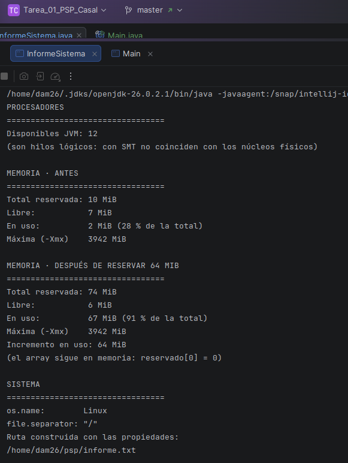
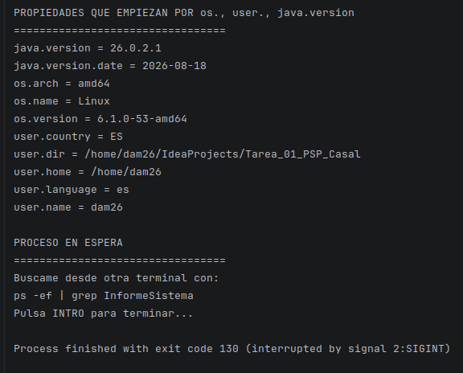
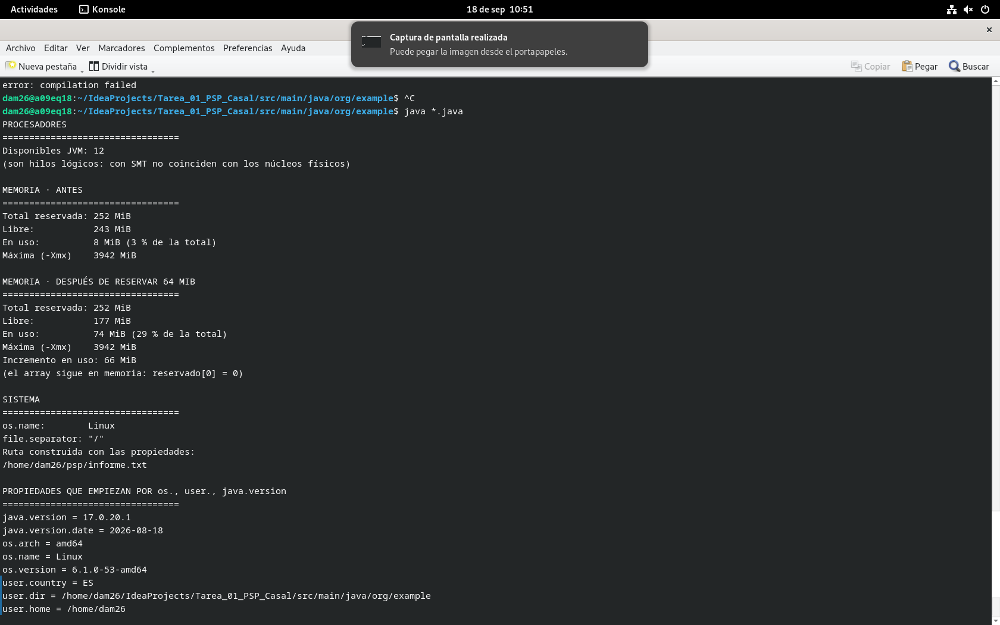
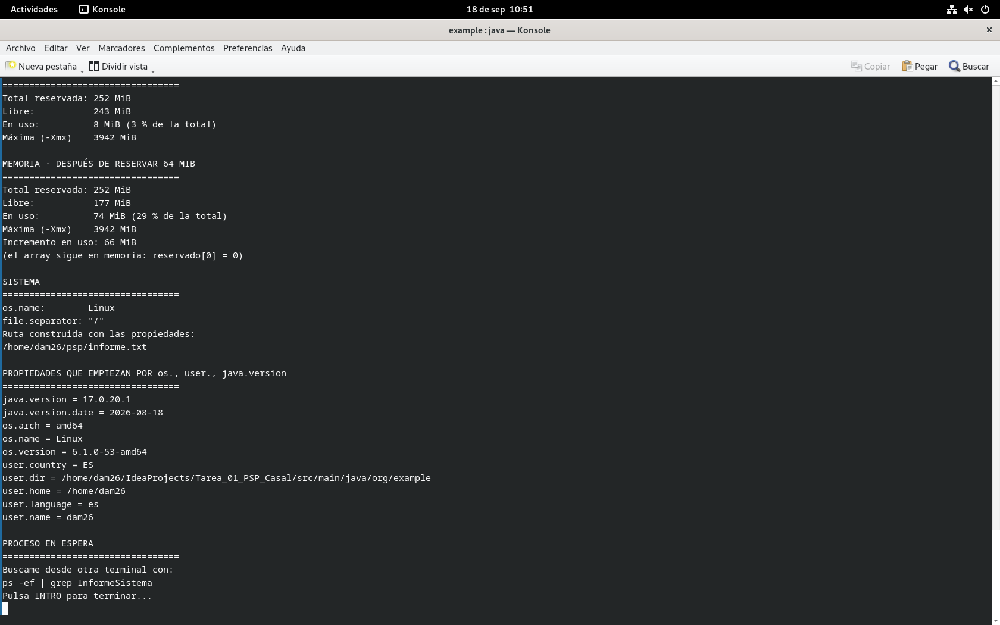
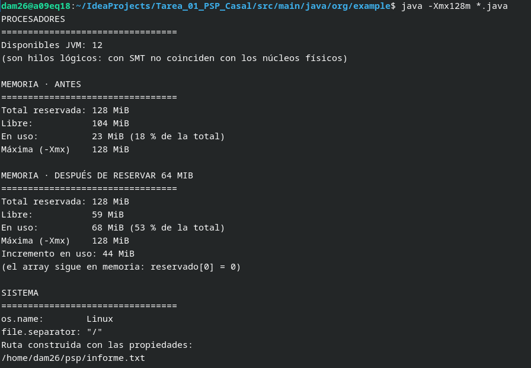
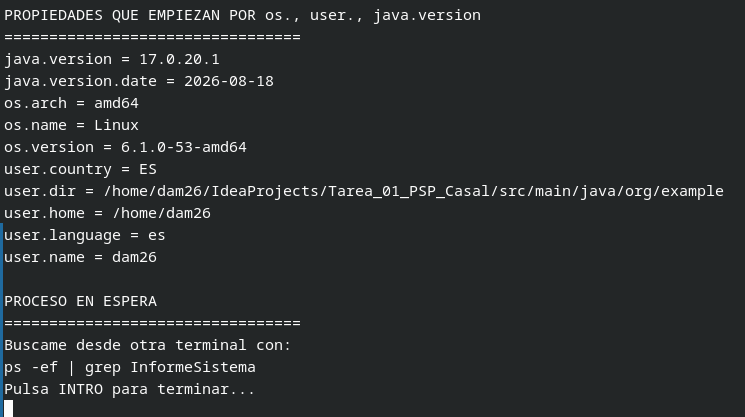
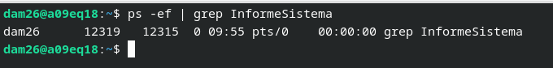

# Tarea 01: Radiografía del sistema

**Alumno:** Casal  
**Curso:** DAM2 (2026-2027)  
**Módulo:** Programación de Servizos e Procesos

---

**Ejecución del programa desde el IDE (Salida):**

**Ejecución del programa desde la Terminal (Salida):**

**Ejecucion de programa desde la Terminal con `java -Xmx128m`

**Localización del proceso en espera desde otra terminal:**

**Prompts de Geminy:**
La unica ayuda de la IA fue para hacer el `.md` visualemente atractivo

## 2. El proceso, desde fuera

### PID, PPID y Proceso Padre
* **PID (Process ID):** Identificador único del proceso en ejecución.
* **PPID (Parent Process ID):** Identificador del proceso padre que lo ha iniciado.
* **Explicación Proceso Padre:**
  Al ejecutar la aplicación desde la línea de comandos, el **PPID** pertenece al proceso del intérprete de comandos. La terminal es quien llama al sistema para lanzar la Máquina Virtual de Java.

### Comparación: Ejecución desde Terminal vs. IDE
* **¿Cambia el PPID?** **Sí**, cambia.
* **Explicación:**
    * **Desde la Terminal:** El padre directo es el PID de la terminal.
    * **Desde el IDE (IntelliJ):** El proceso padre es el propio proceso del IDE.

### Límite de Memoria: `java -Xmx128m InformeSistema`
Al aplicar el parámetro `-Xmx128m`, limitamos el tamaño máximo de la memoria Heap a 128 MiB.

* **Cifras que cambian:**
    * **Memoria Máxima (`maxMemory()`):** Pasa de varios GiB (valor por defecto) a fijarse en `128 MiB`.
* **Cifras que NO cambian:**
    * **Memoria Total reservada (`totalMemory()`), Libre (`freeMemory()`) y En uso:** Se mantienen prácticamente igual al arrancar el programa, pues el consumo de la aplicación al instanciarse no cambia.
* **Justificación:** El parámetro `-Xmx` solo fija el límite máximo (*Heap*) que la JVM puede pedir al sistema, pero no afecta a la memoria que reserva o consume inicialmente.

### Rutas Multiplataforma
* **Ruta generada en Linux/macOS:**
  `/home/usuario/psp/informe.txt`
* **Ruta generada en Windows:**
  `C:\Users\usuario\psp\informe.txt`
* **Origen de la diferencia:**  
  La diferencia se debe a la propiedad `file.separator`. Linux/UNIX utiliza `/` y Windows utiliza `\`. Al usar `System.getProperty()`, Java obtiene el separador y la carpeta del usuario (`user.home`) correspondientes a cada sistema operativo automáticamente.

---

## 3. Qué tipo de programación encaja

**a) Un servidor web que atiende 500 peticiones a la vez en una máquina de 8 núcleos.**
* **Tipo:** Concurrente y Paralela.
* **Justificación:** Concurrente porque la aplicación intercala las 500 peticiones en hilos; Paralela porque los 8 núcleos procesan 8 de ellas simultáneamente en el hardware.
* **Inconveniente:** Condiciones de carrera al modificar recursos compartidos al mismo tiempo.

---

**b) Renderizar una película de animación en un plazo de tres meses.**
* **Tipo:** Distribuida (Render Farm).
* **Justificación:** El cálculo es demasiado masivo para un solo equipo; se dividen los fotogramas entre un clúster de nodos conectados por red.
* **Inconveniente:** Latencia de red al enviar los datos y riesgo de fallos parciales si cae un nodo.

---

**c) Una app de móvil que descarga un fichero mientras seguís navegando.**
* **Tipo:** Concurrente.
* **Justificación:** Separa la interfaz y la descarga en distintos hilos para evitar que la pantalla se congele mientras se espera por la red.
* **Inconveniente:** Complejidad para actualizar la interfaz gráfica desde un hilo secundario sin lanzar excepciones.

---

**d) Un cálculo que no cabe en la RAM de un solo equipo.**
* **Tipo:** Distribuida.
* **Justificación:** Al sobrepasar la RAM local, se fragmentan los datos entre la memoria combinada de varias máquinas.
* **Inconveniente:** Rendimiento mucho más lento por el envío de datos a través de la red (paso de mensajes).